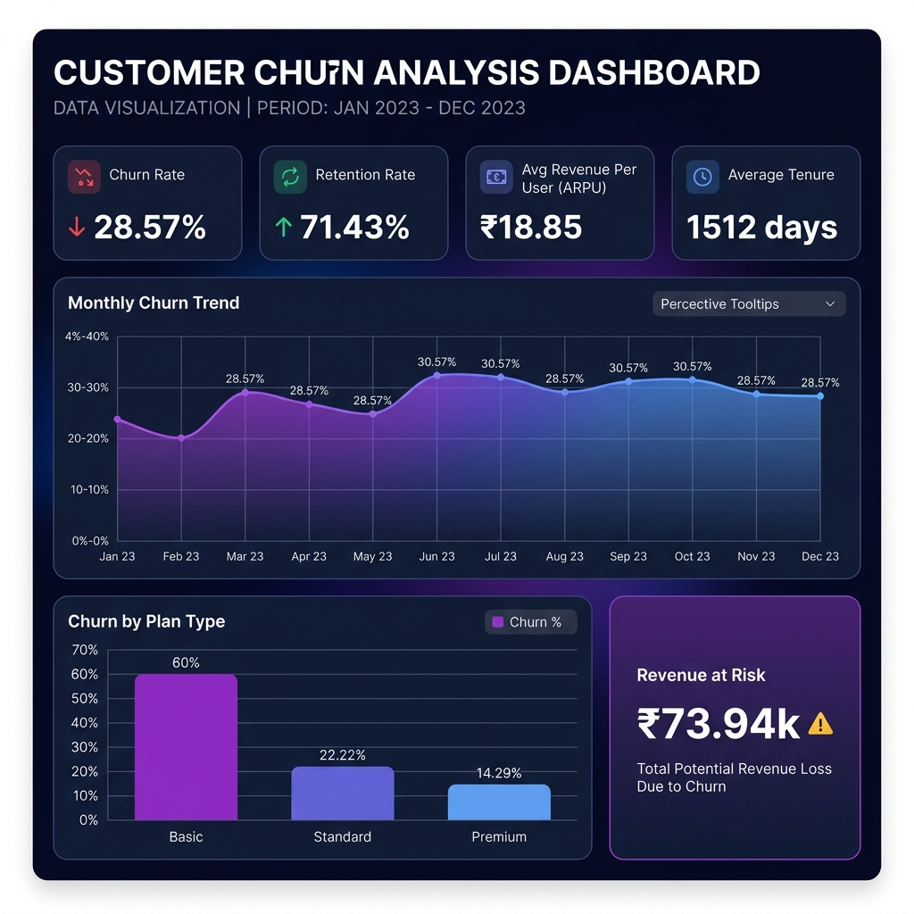
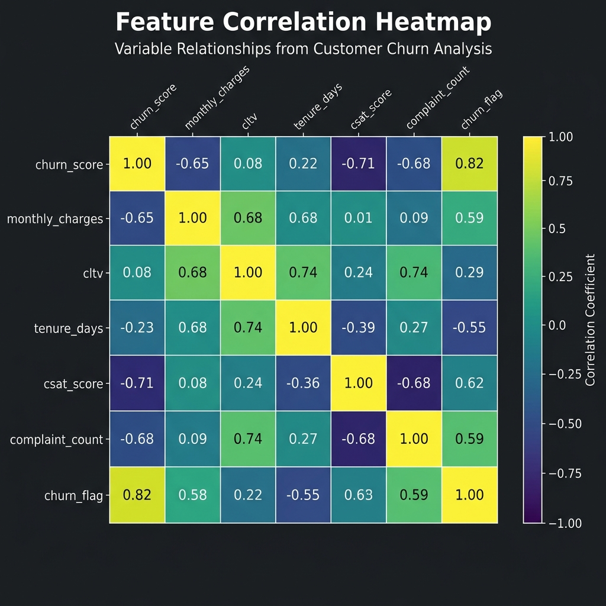
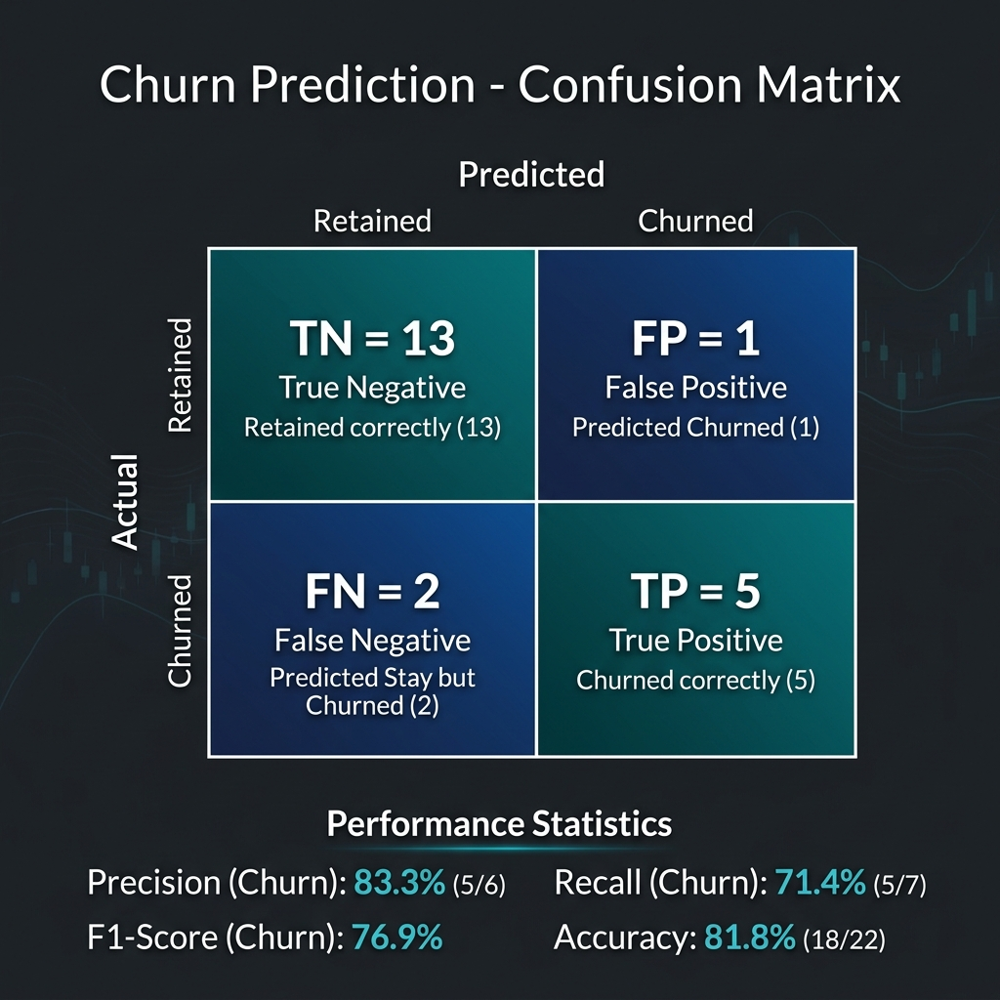

# 📊 Customer Churn Analysis

A comprehensive end-to-end data analysis project that identifies, analyses, and visualises customer churn patterns for a subscription-based service — enabling data-driven retention strategies.

---

## 🚨 Problem Statement

**Customer churn** is one of the most critical challenges for subscription-based businesses. Losing customers directly impacts revenue, growth, and Customer Lifetime Value (CLTV).

### The Problem
- The business lacks visibility into **which customers are churning**, **why they leave**, and **when they are most likely to cancel**.
- Without this insight, retention efforts are reactive and unstructured.
- There is no mechanism to segment customers by **risk level** before they churn.

### The Solution
This project analyses customer subscription, demographic, and support data to:
1. **Quantify churn** — measure the churn rate, retention rate, and revenue at risk.
2. **Identify patterns** — discover which plan types, geographies, and support behaviour correlate with churn.
3. **Score and segment risk** — classify customers as Low / Medium / High churn risk using an existing churn score.
4. **Visualise insights** — produce actionable charts and dashboards for business stakeholders.

---

## 📁 Project Structure

```
churn_analysis/
│
├── data/
│   ├── raw/                          # Original source data
│   │   ├── customer_churn_data_raw.db
│   │   ├── customer_churn_data_raw.xlsx
│   │   └── test_database.sqlite
│   └── processed/
│       └── exported_churn_data.csv   # Cleaned & merged dataset
│
├── notebooks/
│   └── project_analysis.ipynb        # Main analysis notebook
│
├── images/
│   ├── dashboard.png                 # KPI summary dashboard
│   ├── correlation_heatmap.png       # Feature correlation heatmap
│   └── confusion_matrix.png          # Model evaluation matrix
│
├── reports/                          # (optional PDF reports)
├── requirements.txt
├── README.md
├── .gitignore
└── LICENSE
```

---

## 🗃️ Data Sources

The raw data is stored in a **SQLite database** (`customer_churn_data_raw.db`) loaded from an Excel file (`customer_churn_data_raw.xlsx`) with three tables:

| Table | Key Columns | Description |
|---|---|---|
| `db_customer` | customerid, name, country, state, gender, dob | Customer demographics |
| `db_subscription` | customerid, plan_type, contract_type, monthly_charges, cltv, churn_score, churn_flag | Subscription & churn info |
| `db_support` | customerid, complaint_date, escalations, csat_score | Support interactions |

---

## 🧹 Data Cleaning

The following cleaning steps were applied to the raw data before analysis:

| Step | Issue | Fix Applied |
|---|---|---|
| Column rename | `name` → `customer_name` | `df.rename()` |
| Drop irrelevant columns | `interests`, `pincode` (mostly null) | `df.drop()` |
| Data type fix | `dob` stored as string | `pd.to_datetime()` |
| Gender standardisation | Inconsistent values (`Men`, `Women`, `Male`, `Female`) | `.replace()` mapping |
| Missing values | `country` had 3 null values | Inferred from state-country mapping |
| Support table deduplication | Multiple support rows per customer | Kept latest complaint, computed `complaint_count` |

The three tables were merged into a **single master DataFrame** (21 rows × 23 columns) and exported to `data/processed/exported_churn_data.csv`.

---

## 📈 Key Metrics & Findings

| Metric | Value |
|---|---|
| **Churn Rate** | 28.57% |
| **Retention Rate** | 71.43% |
| **ARPU** (Avg Revenue per User) | ₹18.85 / month |
| **Avg Customer Tenure** | ~1,512 days |
| **Revenue at Risk** | ₹73.94k (from churned users) |
| **Escalation Rate** | 19.05% |
| **Avg Complaints per User** | 0.43 |
| **Escalation ↔ Churn Correlation** | 0.47 (moderate positive) |

### Churn by Plan Type

| Plan | Churn Rate | Customers | Total Revenue |
|---|---|---|---|
| Basic | **60%** | 5 | ₹52.95 |
| Standard | 22.22% | 9 | ₹123.91 |
| Premium | 14.29% | 7 | ₹218.93 |

> **Key insight:** Basic plan customers churn at 4× the rate of Premium customers.

### Churn Risk Segmentation

Customers were classified by `churn_score`:

| Risk Level | Score Range |
|---|---|
| Low | < 50 |
| Medium | 50 – 69 |
| High | ≥ 70 |

### Top Cancellation Reasons

- Switched to competitor
- Too expensive
- Not enough content
- Poor streaming quality

---

## 📊 Visualisations

### Dashboard



*KPI summary: Churn Rate, Retention Rate, ARPU, Avg Tenure, Monthly Churn Trend, and Churn by Plan Type.*

---

### Correlation Heatmap



*Correlation between key features: churn_score, monthly_charges, cltv, tenure_days, csat_score, complaint_count, and churn_flag.*

---

### Confusion Matrix



*Churn prediction evaluation showing True Positives, True Negatives, False Positives, and False Negatives with Precision and Recall metrics.*

---

## 🧪 Visualisations Produced in Notebook

| Chart | Description |
|---|---|
| Monthly Churn Trend (Line) | Churned customers per month over time |
| Churn by Plan Type (Bar) | Churn rate across Basic / Standard / Premium |
| Churn Risk Distribution | Count of low / medium / high risk customers |
| CSAT Score by Churn Group | Customer satisfaction split by churned vs retained |
| Charges vs CLTV scatter | Monthly charges vs Customer Lifetime Value |
| Gender breakdown (catplot) | Monthly charges by plan type, gender, and churn risk |

---

## ⚙️ Tech Stack

| Tool | Purpose |
|---|---|
| Python 3.13 | Core language |
| Pandas | Data manipulation & cleaning |
| NumPy | Numerical operations |
| Matplotlib | Plotting & visualisation |
| Seaborn | Advanced statistical charts |
| SQLite3 | Database connectivity |

---

## 🚀 Getting Started

### 1. Clone the repository
```bash
git clone <your-repo-url>
cd churn_analysis
```

### 2. Install dependencies
```bash
pip install -r requirements.txt
```

### 3. Run the notebook
```bash
jupyter notebook notebooks/project_analysis.ipynb
```

> **Note:** Make sure the working directory is set to the project root so relative file paths resolve correctly.

---

## 📌 Business Recommendations

1. **Focus retention efforts on Basic plan users** — 60% churn rate demands targeted offers or upgrade incentives.
2. **Escalation management matters** — a 0.47 correlation between escalations and churn means faster resolution = fewer churns.
3. **Monitor high churn-score customers proactively** — segment and reach out before cancellation.
4. **Address pricing concerns** — "Too expensive" is a top cancellation reason; consider tiered pricing or loyalty discounts.

---

## 📄 License

This project is licensed under the terms in the [LICENSE](LICENSE) file.